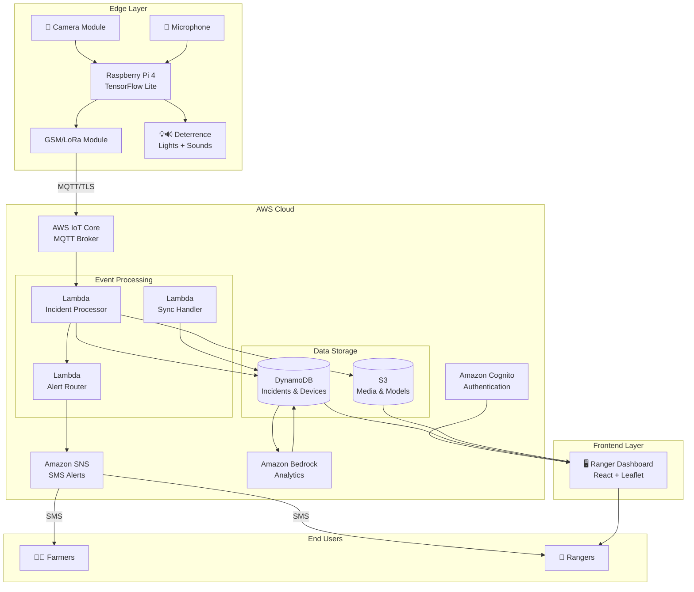
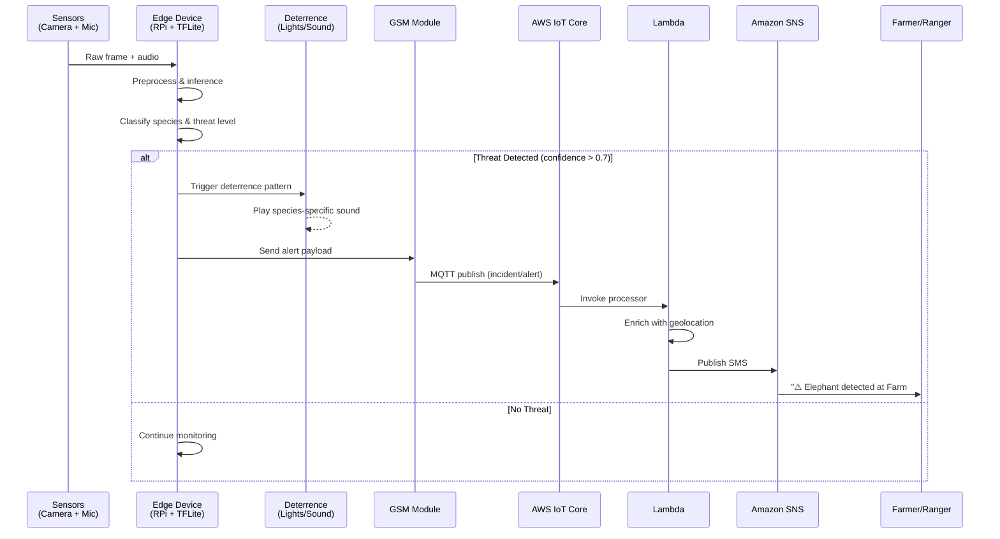
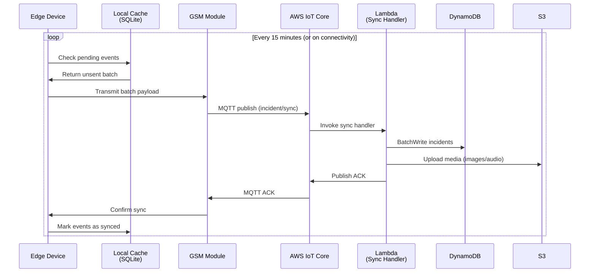
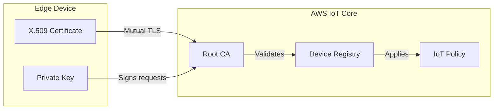
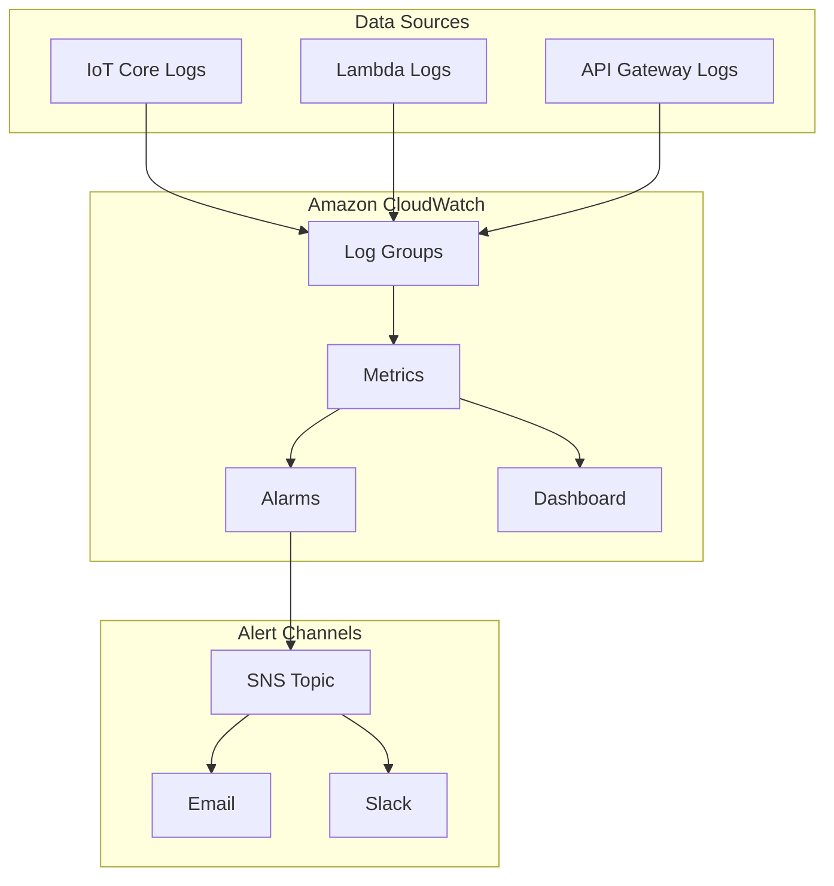

# AgriShield AI – Architecture

## 1. Overview

AgriShield AI is a distributed wildlife detection and deterrence system designed to protect rural farmland from crop-raiding animals while preserving endangered species. The system addresses human–wildlife conflict—a critical issue in regions like India and Sub-Saharan Africa where farmers lose significant portions of their harvest to elephants, boars, deer, and other wildlife.

### Design Goals

| Goal | Rationale |
|------|-----------|
| **Offline-First** | Rural deployments often lack reliable internet; devices must operate autonomously |
| **Low-Cost Hardware** | Affordable edge devices (~$50-100) enable widespread adoption |
| **Low-Bandwidth** | SMS and LoRa communication work where cellular data is unreliable or expensive |
| **Non-Lethal** | Humane deterrence protects both crops and wildlife |
| **Scalable** | Serverless cloud architecture supports hundreds of devices per region |

---

## 2. Component Diagram

### Major Components

| Component | Description |
|-----------|-------------|
| **Edge Device** | Raspberry Pi 4 with camera module, USB microphone, and GSM/LoRa HAT for communication |
| **AWS IoT Core** | Managed MQTT broker for secure device-to-cloud messaging |
| **AWS Lambda** | Serverless functions for event processing, alert routing, and data transformation |
| **Amazon SNS** | SMS delivery to farmers and rangers within alert radius |
| **Amazon DynamoDB** | NoSQL storage for incident records and device metadata |
| **Amazon S3** | Object storage for images, audio clips, and ML model artifacts |
| **Amazon Bedrock** | Optional LLM-powered analytics for pattern detection and route prediction |
| **Ranger Dashboard** | React web application for incident visualization and device management |

### System Architecture Diagram



---

## 3. Data Flow

### 3a. Real-Time Alerting Flow

When an animal is detected, the system triggers immediate deterrence and alerts within seconds.



### 3b. Periodic Sync Flow

Incident logs and device telemetry are batched and synced when connectivity is available.



---

## 4. Edge Device Design

### Processing Pipeline

```
┌─────────┐    ┌─────────────┐    ┌─────────────┐    ┌──────────┐    ┌──────────┐
│ CAPTURE │───▶│ PREPROCESS  │───▶│   INFER     │───▶│ CLASSIFY │───▶│  DECIDE  │
│         │    │             │    │             │    │          │    │          │
│ 640x480 │    │ Resize to   │    │ TFLite      │    │ Species  │    │ Deter?   │
│ 15 FPS  │    │ 224x224     │    │ MobileNet   │    │ + Threat │    │ Alert?   │
│ + Audio │    │ Normalize   │    │ ~50ms/frame │    │ Level    │    │ Log?     │
└─────────┘    └─────────────┘    └─────────────┘    └──────────┘    └──────────┘
```

### Model Specifications

| Attribute | Value |
|-----------|-------|
| Framework | TensorFlow Lite |
| Base Model | MobileNetV2 (fine-tuned) |
| Input Size | 224 × 224 × 3 |
| Classes | Elephant, Boar, Deer, Leopard, Human, Unknown |
| Inference Time | ~50ms on RPi 4 |
| Model Size | ~8 MB |

### Connectivity Handling

The edge device implements a robust offline-first strategy:

```python
# Pseudocode for connectivity handling
class ConnectivityManager:
    def __init__(self):
        self.cache = SQLiteCache("events.db")
        self.max_cache_size = 1000  # events
        self.sync_interval = 900    # 15 minutes
    
    def on_incident(self, event):
        # Always cache locally first
        self.cache.store(event)
        
        # Attempt immediate send for high-priority alerts
        if event.threat_level == "HIGH":
            if self.try_send_sms(event):
                return
            # Fall back to LoRa if GSM unavailable
            self.try_send_lora(event)
    
    def periodic_sync(self):
        if not self.has_connectivity():
            return
        
        pending = self.cache.get_unsent(limit=50)
        if self.bulk_upload(pending):
            self.cache.mark_synced(pending)
```

### Local Caching Strategy

| Scenario | Behavior |
|----------|----------|
| **Normal operation** | Events cached locally, synced every 15 min |
| **No connectivity** | Events accumulate in SQLite (up to 1000) |
| **High-priority alert** | Immediate SMS attempt, then LoRa fallback |
| **Cache full** | Oldest low-priority events evicted (FIFO) |
| **Connectivity restored** | Bulk sync of all pending events |

---

## 5. Security & Privacy

### Device Authentication



Each edge device is provisioned with:
- **X.509 certificate** issued by AWS IoT CA
- **Unique Thing Name** registered in IoT Core
- **IoT Policy** restricting publish/subscribe to device-specific topics

### IAM & Access Control

| Resource | Principal | Permissions |
|----------|-----------|-------------|
| DynamoDB (incidents) | Lambda execution role | Read/Write |
| DynamoDB (incidents) | Dashboard API | Read only |
| S3 (media bucket) | Lambda execution role | PutObject |
| S3 (media bucket) | Dashboard (presigned) | GetObject |
| SNS (alerts topic) | Lambda execution role | Publish |

### Encryption

| Layer | Mechanism |
|-------|-----------|
| **In Transit** | TLS 1.2+ for all MQTT and HTTPS connections |
| **At Rest (DynamoDB)** | AWS-managed encryption (AES-256) |
| **At Rest (S3)** | SSE-S3 with bucket-level encryption |
| **Secrets** | AWS Secrets Manager for API keys |

### Dashboard Authentication


- Amazon Cognito User Pool for ranger/admin authentication
- JWT tokens with 1-hour expiry
- Role-based access: `ranger` (read-only) vs `admin` (full access)

---

## 6. Scalability & Reliability

### Scaling Strategy

| Component | Scaling Mechanism |
|-----------|-------------------|
| **Edge Devices** | Horizontal—add more devices per region |
| **IoT Core** | Managed service, auto-scales to millions of connections |
| **Lambda** | Auto-scales based on invocation rate (1000 concurrent default) |
| **DynamoDB** | On-demand capacity mode, scales automatically |
| **SNS** | Managed service, handles burst traffic |

### Capacity Planning

```
Target: 500 devices per region
Detection rate: 10 events/device/day
Peak factor: 3x (dawn/dusk activity)

Daily events: 500 × 10 = 5,000
Peak events/hour: 5,000 × 3 / 24 ≈ 625
Lambda invocations: ~625/hour (well within limits)
DynamoDB WCU: ~10 WCU (on-demand handles this easily)
```

### Monitoring & Observability



Key metrics monitored:
- **Device heartbeat** – Alert if device offline > 30 min
- **Detection latency** – P99 < 2 seconds
- **SMS delivery rate** – Alert if < 95%
- **Lambda errors** – Alert on error rate > 1%

---

## 7. Future Extensions

### Planned Enhancements

| Extension | Description | Priority |
|-----------|-------------|----------|
| **Thermal Imaging** | Night vision capability for nocturnal species | High |
| **PIR Motion Sensors** | Wake-on-motion to reduce power consumption | High |
| **Model Improvements** | Expand species coverage, improve accuracy | Medium |
| **LoRa Mesh Network** | Device-to-device communication for remote areas | Medium |
| **Community Dashboard** | Public heatmaps for conservation partners | Low |
| **Mobile App** | Native iOS/Android app for farmers | Low |

### ML Model Roadmap

```
v1.0 (Current)     v1.5 (Q2)           v2.0 (Q4)
─────────────────────────────────────────────────────
6 species          12 species          20+ species
MobileNetV2        EfficientNet-Lite   Custom model
~85% accuracy      ~90% accuracy       ~95% accuracy
Image only         Image + audio       Multi-modal fusion
```

### Integration Opportunities

- **Conservation APIs** – Share anonymized data with wildlife tracking platforms
- **Weather Services** – Correlate incidents with weather patterns
- **Satellite Imagery** – Identify migration corridors and habitat changes
- **Government Systems** – Integration with forest department alert systems

---

## Appendix: Technology Stack Summary

| Layer | Technology |
|-------|------------|
| Edge Hardware | Raspberry Pi 4, Camera Module v2, USB Microphone, SIM7600 GSM HAT |
| Edge Software | Python 3.9, TensorFlow Lite, OpenCV, SQLite |
| Messaging | AWS IoT Core (MQTT), Amazon SNS (SMS) |
| Compute | AWS Lambda (Python 3.9 runtime) |
| Storage | Amazon DynamoDB, Amazon S3 |
| Analytics | Amazon Bedrock (Claude), Amazon QuickSight |
| Frontend | React 18, Leaflet.js, Tailwind CSS |
| Auth | Amazon Cognito |
| IaC | AWS CDK (TypeScript) |
| CI/CD | GitHub Actions |

---

*Last updated: January 2026*
