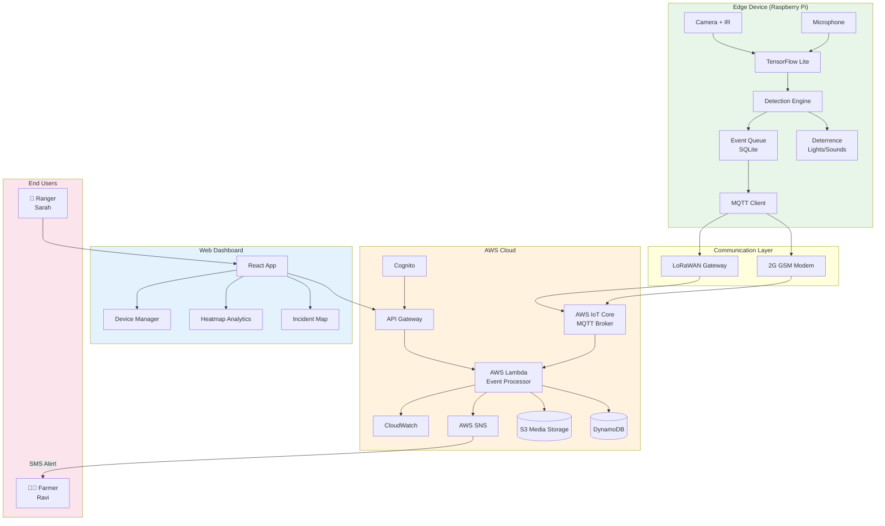

# AgriShield AI - Design Document

**Project Name:** AgriShield AI  
**Team Name:** CodeSavanna  
**Version:** 1.0  
**Last Updated:** January 2026

---

## 1. System Architecture

### 1.1 Overview

AgriShield AI follows an edge-first architecture where all critical detection and deterrence logic runs locally on the device. The cloud layer provides data aggregation, analytics, and dashboard capabilities.

### 1.2 Architecture Components

#### Edge Layer (Field Deployment)
- **Raspberry Pi 4** running TensorFlow Lite models
- **Pi Camera Module** (with IR for night vision)
- **USB Microphone** for acoustic detection
- **GPIO-connected actuators** (lights, speakers)
- **Solar panel + LiPo battery** for power
- **2G GSM modem** for connectivity

#### Communication Layer
- **MQTT Protocol** for lightweight, reliable messaging
- **AWS IoT Core** as the MQTT broker
- **LoRaWAN Gateway** (optional) for areas without cellular

#### Cloud Layer (AWS)
- **AWS IoT Core** - Device management and message routing
- **AWS Lambda** - Serverless event processing
- **Amazon DynamoDB** - Incident and device data storage
- **AWS SNS** - SMS alert delivery
- **Amazon S3** - Media storage (images, audio clips)
- **Amazon CloudWatch** - Monitoring and logging

#### Application Layer
- **React Dashboard** - Web-based monitoring interface
- **AWS Cognito** - User authentication
- **API Gateway** - RESTful API endpoints

### 1.3 Architecture Flow

```
┌─────────────────────────────────────────────────────────────────────────────┐
│                              EDGE DEVICE (Field)                            │
│  ┌──────────┐   ┌──────────────┐   ┌─────────────┐   ┌──────────────────┐  │
│  │ Camera   │──▶│ TensorFlow   │──▶│ Detection   │──▶│ Deterrence       │  │
│  │ + Mic    │   │ Lite Model   │   │ Engine      │   │ (Lights/Sounds)  │  │
│  └──────────┘   └──────────────┘   └──────┬──────┘   └──────────────────┘  │
│                                           │                                 │
│                                    ┌──────▼──────┐                         │
│                                    │ Event Queue │                         │
│                                    │ (Offline)   │                         │
│                                    └──────┬──────┘                         │
└───────────────────────────────────────────┼─────────────────────────────────┘
                                            │ MQTT
                                            ▼
┌─────────────────────────────────────────────────────────────────────────────┐
│                              AWS CLOUD                                      │
│  ┌──────────────┐   ┌──────────────┐   ┌──────────────┐   ┌─────────────┐  │
│  │ AWS IoT Core │──▶│ AWS Lambda   │──▶│ DynamoDB     │   │ S3 (Media)  │  │
│  │ (MQTT)       │   │ (Processing) │   │ (Storage)    │   │             │  │
│  └──────────────┘   └──────┬───────┘   └──────────────┘   └─────────────┘  │
│                            │                                                │
│                     ┌──────▼───────┐                                       │
│                     │ AWS SNS      │──────▶ SMS to Farmer                  │
│                     │ (Alerts)     │                                       │
│                     └──────────────┘                                       │
└─────────────────────────────────────────────────────────────────────────────┘
                                            │
                                            ▼
┌─────────────────────────────────────────────────────────────────────────────┐
│                           DASHBOARD (React)                                 │
│  ┌──────────────┐   ┌──────────────┐   ┌──────────────┐                    │
│  │ Real-time    │   │ Heatmap      │   │ Device       │                    │
│  │ Incident Map │   │ Analytics    │   │ Management   │                    │
│  └──────────────┘   └──────────────┘   └──────────────┘                    │
└─────────────────────────────────────────────────────────────────────────────┘
```

---

## 2. Data Flow

### 2.1 Detection Flow (Edge)

```
1. SENSOR INPUT
   ├── Camera captures frame (640x480, 5 FPS)
   └── Microphone captures audio (16kHz, 1s windows)
           │
           ▼
2. PREPROCESSING
   ├── Image: Resize, normalize, convert to tensor
   └── Audio: FFT, mel-spectrogram generation
           │
           ▼
3. LOCAL INFERENCE (TensorFlow Lite)
   ├── Visual model: MobileNetV2 (quantized)
   └── Acoustic model: Custom CNN
           │
           ▼
4. DETECTION ENGINE
   ├── Confidence threshold check (>0.85)
   ├── Species classification
   └── False positive filtering
           │
           ▼
5. ACTION DISPATCH
   ├── Trigger deterrence (GPIO)
   ├── Queue alert event
   └── Log to local storage
```

### 2.2 Cloud Sync Flow

```
1. EVENT QUEUE (Local SQLite)
   │
   ▼
2. CONNECTIVITY CHECK
   ├── If online → Proceed to sync
   └── If offline → Retry in 5 minutes
   │
   ▼
3. MQTT PUBLISH
   Topic: agrishield/{device_id}/incidents
   Payload: JSON event packet
   │
   ▼
4. AWS IoT Core
   ├── Message routing rules
   └── Device shadow update
   │
   ▼
5. AWS Lambda (Processing)
   ├── Validate payload
   ├── Enrich with geolocation
   ├── Store in DynamoDB
   └── Trigger SNS notification
   │
   ▼
6. AWS SNS
   └── SMS to registered phone numbers
```

### 2.3 Event Packet Structure

```json
{
  "event_id": "uuid-v4",
  "device_id": "AS-001",
  "timestamp": "2026-01-25T14:32:00Z",
  "location": {
    "lat": -1.2921,
    "lng": 36.8219
  },
  "detection": {
    "species": "elephant",
    "confidence": 0.94,
    "method": "acoustic",
    "model_version": "v1.2.0"
  },
  "deterrence": {
    "triggered": true,
    "type": ["strobe", "sound"],
    "duration_ms": 5000
  },
  "device_status": {
    "battery_percent": 78,
    "solar_charging": true,
    "temperature_c": 32
  },
  "media_ref": "s3://agrishield-media/AS-001/2026-01-25/capture_001.jpg"
}
```

---

## 3. Database Schema

### 3.1 DynamoDB Tables

#### Table: `Incidents`

| Attribute | Type | Description |
|-----------|------|-------------|
| `id` | String (PK) | UUID v4 |
| `device_id` | String (SK) | Device identifier |
| `timestamp` | String | ISO 8601 datetime |
| `location` | Map | `{lat: Number, lng: Number}` |
| `species` | String | Detected species name |
| `confidence` | Number | Detection confidence (0-1) |
| `detection_method` | String | "visual" or "acoustic" |
| `deterrence_triggered` | Boolean | Whether deterrence activated |
| `media_url` | String | S3 URL to captured media |
| `created_at` | String | Record creation timestamp |

**GSI:** `device_id-timestamp-index` for querying incidents by device and time range.

#### Table: `Devices`

| Attribute | Type | Description |
|-----------|------|-------------|
| `id` | String (PK) | Device identifier (e.g., "AS-001") |
| `name` | String | Human-readable name |
| `location` | Map | `{lat: Number, lng: Number}` |
| `status` | String | "online", "offline", "maintenance" |
| `battery_level` | Number | Battery percentage (0-100) |
| `last_seen` | String | Last heartbeat timestamp |
| `firmware_version` | String | Current firmware version |
| `owner_phone` | String | Farmer's phone number for alerts |
| `created_at` | String | Device registration timestamp |
| `updated_at` | String | Last update timestamp |

#### Table: `Users`

| Attribute | Type | Description |
|-----------|------|-------------|
| `id` | String (PK) | Cognito user ID |
| `email` | String | User email |
| `role` | String | "farmer", "ranger", "admin" |
| `assigned_devices` | List | List of device IDs |
| `created_at` | String | Account creation timestamp |

---

## 4. API Endpoints

### 4.1 Base URL
```
https://api.agrishield.io/v1
```

### 4.2 Incident Endpoints

#### POST /api/v1/incident
Create a new incident record (called by Lambda from IoT Core).

**Request:**
```json
{
  "device_id": "AS-001",
  "timestamp": "2026-01-25T14:32:00Z",
  "location": {"lat": -1.2921, "lng": 36.8219},
  "species": "elephant",
  "confidence": 0.94,
  "detection_method": "acoustic",
  "deterrence_triggered": true,
  "media_url": "s3://agrishield-media/..."
}
```

**Response:** `201 Created`
```json
{
  "id": "550e8400-e29b-41d4-a716-446655440000",
  "message": "Incident recorded successfully"
}
```

#### GET /api/v1/incidents
List incidents with filtering.

**Query Parameters:**
- `device_id` (optional): Filter by device
- `species` (optional): Filter by species
- `start_date` (optional): ISO 8601 start date
- `end_date` (optional): ISO 8601 end date
- `limit` (optional): Max results (default 50)

**Response:** `200 OK`
```json
{
  "incidents": [...],
  "count": 42,
  "next_token": "..."
}
```

### 4.3 Analytics Endpoints

#### GET /api/v1/analytics/heatmap
Get aggregated incident data for heatmap visualization.

**Query Parameters:**
- `start_date` (required): ISO 8601 start date
- `end_date` (required): ISO 8601 end date
- `species` (optional): Filter by species
- `resolution` (optional): "hour", "day", "week" (default "day")

**Response:** `200 OK`
```json
{
  "heatmap_data": [
    {
      "lat": -1.2921,
      "lng": 36.8219,
      "intensity": 15,
      "species_breakdown": {
        "elephant": 10,
        "boar": 5
      }
    }
  ],
  "total_incidents": 156,
  "date_range": {
    "start": "2026-01-01",
    "end": "2026-01-25"
  }
}
```

#### GET /api/v1/analytics/summary
Get summary statistics for dashboard.

**Response:** `200 OK`
```json
{
  "total_incidents_today": 12,
  "total_incidents_week": 87,
  "active_devices": 45,
  "species_distribution": {
    "elephant": 45,
    "boar": 38,
    "rhino": 4
  },
  "deterrence_success_rate": 0.89
}
```

### 4.4 Device Endpoints

#### GET /api/v1/devices
List all devices.

#### GET /api/v1/devices/{device_id}
Get device details and status.

#### PUT /api/v1/devices/{device_id}
Update device configuration.

---

## 5. Security

### 5.1 Device Authentication (Edge to Cloud)

**X.509 Certificates:**
- Each device provisioned with unique X.509 certificate
- Certificates stored in AWS IoT Core registry
- Mutual TLS (mTLS) for all MQTT connections
- Certificate rotation every 12 months

**Device Provisioning Flow:**
```
1. Device manufactured with bootstrap certificate
2. First boot: Device calls provisioning Lambda
3. Lambda generates unique certificate via AWS IoT
4. Certificate + private key stored in device secure element
5. Bootstrap certificate revoked
```

### 5.2 User Authentication (Dashboard)

**AWS Cognito:**
- User pools for farmer/ranger accounts
- Multi-factor authentication (optional)
- JWT tokens for API authorization
- Role-based access control (RBAC)

**Roles:**
| Role | Permissions |
|------|-------------|
| `farmer` | View own devices, view own incidents |
| `ranger` | View all devices in region, analytics, reports |
| `admin` | Full access, device provisioning, user management |

### 5.3 Data Security

- **In Transit:** TLS 1.3 for all communications
- **At Rest:** AES-256 encryption for DynamoDB and S3
- **PII Handling:** Phone numbers encrypted, minimal data collection
- **Audit Logging:** CloudTrail enabled for all API calls

### 5.4 Network Security

- **API Gateway:** WAF rules for rate limiting, SQL injection prevention
- **VPC:** Lambda functions in private subnets
- **IoT Policies:** Devices can only publish to their own topics

---

## 6. System Architecture Diagram (Mermaid.js)



---

## 7. Deployment Architecture

### 7.1 Infrastructure as Code

All AWS resources defined in **AWS CDK (TypeScript)**:
- IoT Core thing types and policies
- Lambda functions with layers
- DynamoDB tables with GSIs
- API Gateway with Cognito authorizer
- S3 buckets with lifecycle policies
- CloudWatch dashboards and alarms

### 7.2 CI/CD Pipeline

```
GitHub → CodePipeline → CodeBuild → Deploy
                            │
                            ├── Edge: Build TFLite models, package firmware
                            ├── Lambda: Build, test, deploy functions
                            └── Dashboard: Build React, deploy to S3/CloudFront
```

### 7.3 Environments

| Environment | Purpose |
|-------------|---------|
| `dev` | Development and testing |
| `staging` | Pre-production validation |
| `prod` | Production deployment |

---

## 8. Monitoring & Observability

### 8.1 Metrics

- **Device Health:** Battery level, connectivity, temperature
- **Detection Performance:** Inference latency, accuracy (sampled)
- **System Health:** Lambda duration, DynamoDB capacity, API latency

### 8.2 Alerts

- Device offline > 1 hour
- Battery < 20%
- Lambda errors > 5/minute
- API latency > 2 seconds

### 8.3 Dashboards

- CloudWatch dashboard for operations team
- React dashboard for rangers and farmers
